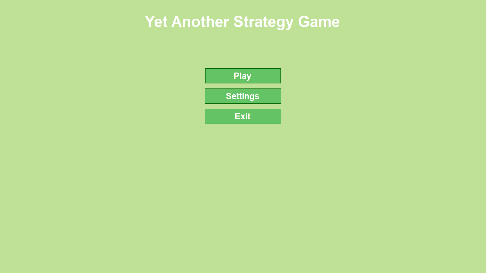
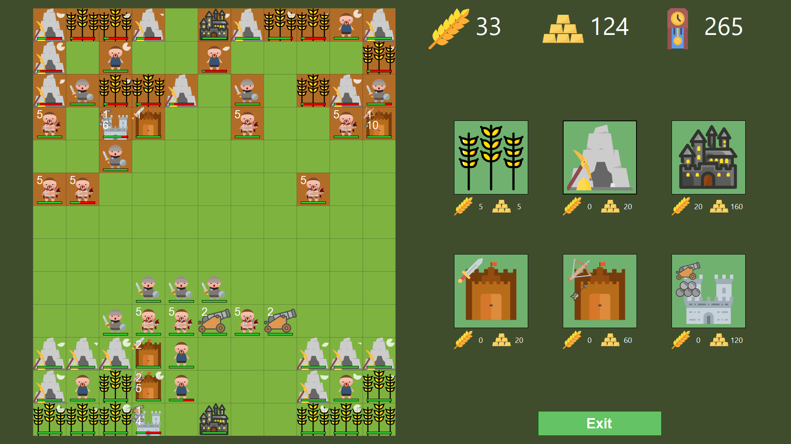
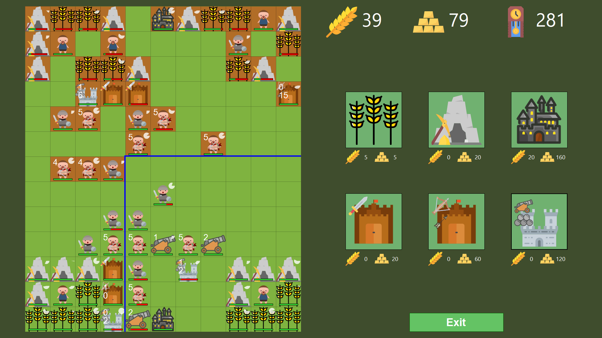
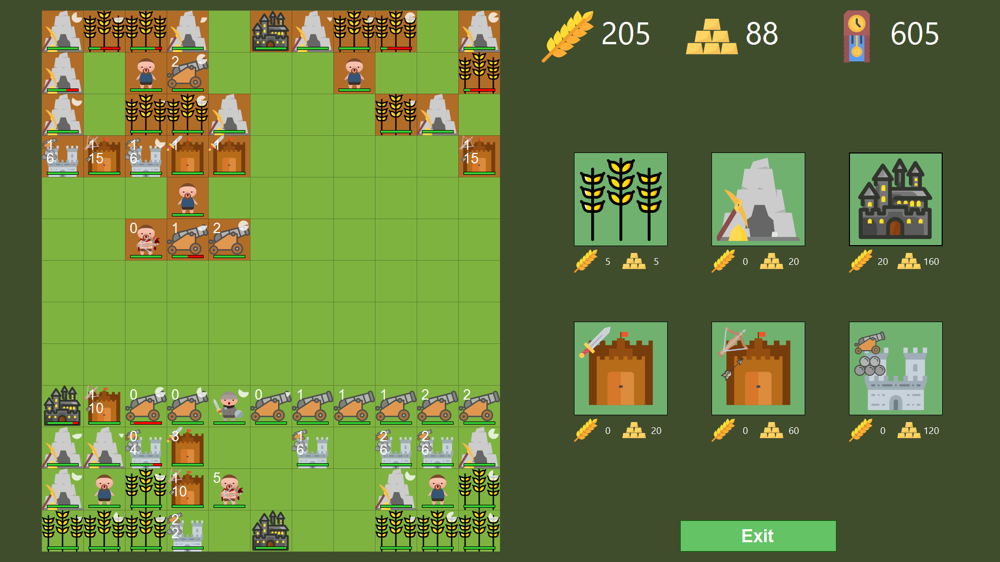
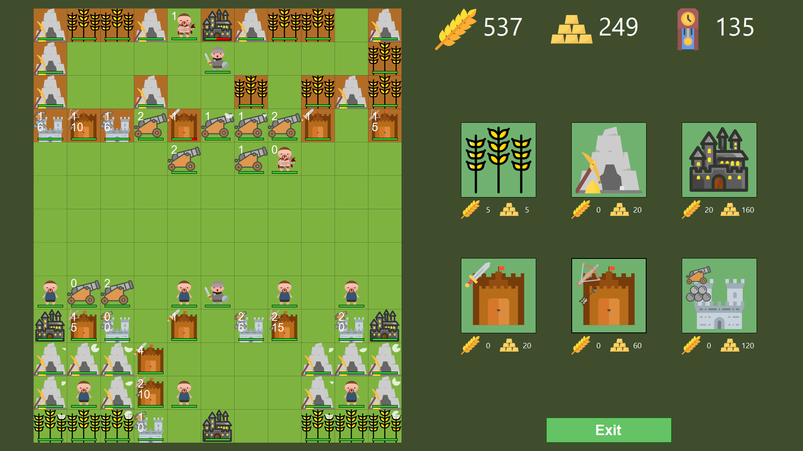

# YetAnotherStrategyGame

RTS-стратегия на Windows Forms, реализованная по паттерну MVC. Геймплей крутится вокруг сбора ресурсов, постройки зданий, накопления армии и атаки.

## Как играть?

Всё управление происходит с помощью ЛКМ, ПКМ и СКМ.

- **Выбор здания для строительства** – ЛКМ по иконке здания в меню справа от поля. После выбора здания его можно разместить на поле, нажав ЛКМ по любой пустой клетке на своей территории. В текущей версии это 4 нижних ряда поля.
- **Производство снаряжения** – если здание что-то производит, нажмите на него ЛКМ, и оно создаст снаряжение. Казармы, арбалетные мастерские и пушечные фабрики при нажатии ЛКМ производят снаряжение. Любой человек может его забрать (ЛКМ по человеку, затем ЛКМ по зданию, в котором есть хотя бы одно снаряжение) и таким образом получить специализацию (воин, арбалетчик, пушка).
- **Создание человека** – при нажатии ЛКМ на замок, если у игрока есть 10 единиц еды, рядом с замком (на пустой клетке) появится человек.
- **Сбор ресурсов** – помимо получения специализации и превращения в военного юнита, человек может собирать ресурсы с ферм и шахт (об автоматическом сборе – в разделе «Особенности»).
- **Пополнение боеприпасов** – нажмите ПКМ на здание, производящее снаряжение для дальних юнитов (арбалетные мастерские, пушечные фабрики), чтобы пополнить запас боеприпасов для этих юнитов.
- **Уничтожение своей сущности** – нажмите СКМ на свою сущность, чтобы она погибла.

## Особенности

- Юниты и здания после любого действия (включая спавн или постройку) должны отдохнуть.
- Во время отдыха использовать сущность нельзя.
- По окончании времени отдыха сущность снова становится доступна для действий.
- Если отдых продолжается дольше необходимого, сущность начинает исцеляться.
- Индикатор отдыха находится в правом верхнем углу иконки сущности на поле.
- Все сущности появляются с небольшим запасом здоровья (ХП).
- Боезапас юнитов дальнего боя не безграничен – его нужно пополнять в специализированных зданиях.
- Радиус атаки юнита обозначается синей границей вокруг него. Радиус взаимодействия с дружественными зданиями (сбор ресурсов, получение специализации человеком, пополнение боеприпасов) и радиус перемещения всегда равны 1.
- Если вокруг человека с полным здоровьем находятся фермы и шахты с полным здоровьем, автоматически происходит сбор ресурсов.
- Победой считается полное уничтожение всех сущностей врага.
- Переиграть искусственный интеллект возможно (проверено)
- Встроенный дружеский ИИ (можно включить в настройках) работает не как вражеский. Он может как проиграть, так и выйграть.
- Игра работает в два потока: UI-поток и поток таймера (`System.Timers.Timer`), в котором происходят все вычисления.

## Скриншоты игры:

## Дополнительная информация

- **Автор:** Бусыгин Степан Алексеевич, РИ-150942/1
- Использованы SVG с [svgrepo.com](https://www.svgrepo.com)
- Вдохновлено играми: _Unciv_, _Age of Empires_, _Spore_
